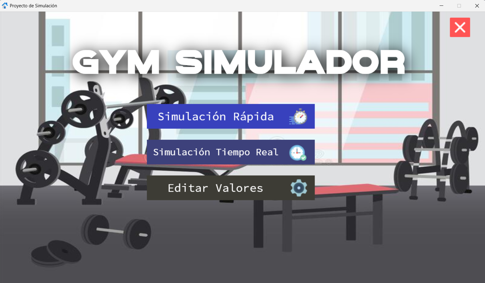
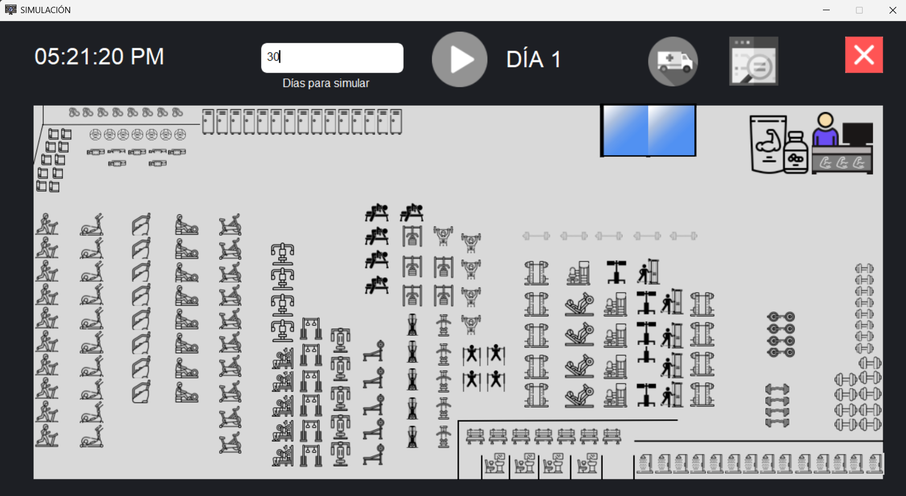
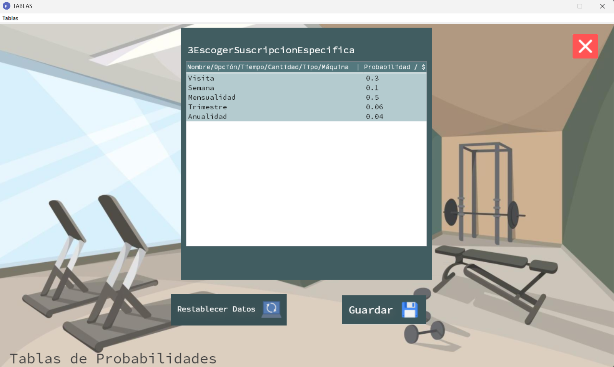
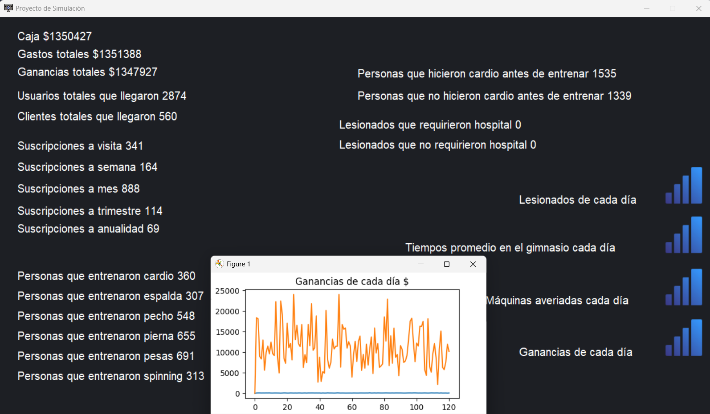
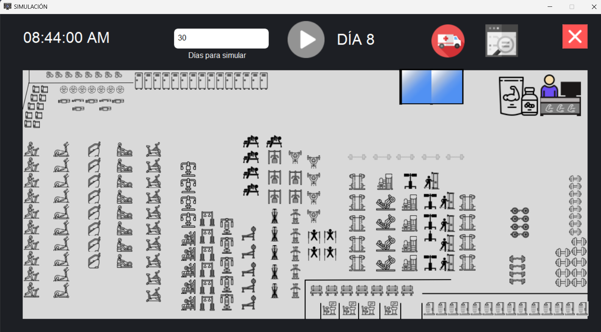
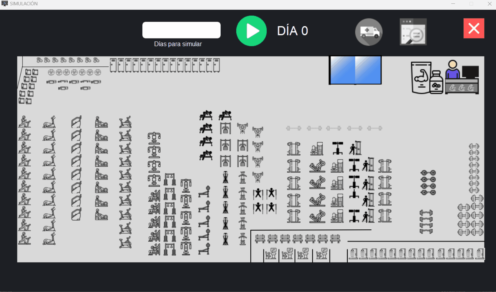

<div align="center">

# GymSimulator

**Simulador de Operación de Gimnasio · Gym Operation Simulator**


</div>

---

## Español

### ¿Qué es GymSimulator?

GymSimulator es una aplicación de escritorio que simula la operación completa y diaria de un gimnasio mediante un motor de simulación estocástica de Montecarlo. Cada evento que ocurre dentro del gimnasio — desde la llegada de un cliente hasta una lesión o una avería de máquina — es determinado por distribuciones de probabilidad configurables, lo que permite modelar distintos escenarios de operación y analizar sus resultados estadísticos.

El proyecto fue desarrollado como proyecto final de una materia de Simulación, y representa la aplicación práctica de conceptos como simulación por eventos discretos, números pseudoaleatorios y modelado de procesos reales.

---

### Capturas del proyecto

<div align="center">

| Menú principal | Simulación en curso |
|:-:|:-:|
|  |  |

| Editor de tablas | Resultados y gráficas |
|:-:|:-:|
|  |  |

</div>

> La ambulancia se activa visualmente cuando un usuario sufre una lesión que requiere hospitalización.
>
> 

<div align="center">



</div>

---

### Funcionalidades principales

- Dos modos de simulación: Rápido (acelerado, ideal para simular muchos días) y Tiempo Real (más lento y visual).
- Motor probabilístico con más de 40 tablas de probabilidad que controlan cada decisión del sistema.
- Flujo completo por persona: calentamiento, cardio previo, entrenamiento por área, compras en tienda, higiene y posibilidad de lesión.
- Gestión de inventario automática: la tienda de suplementos repone productos cuando el stock cae por debajo del umbral mínimo.
- Representación visual del gimnasio con cada zona y equipo en tiempo real.
- Editor de tablas de probabilidad: permite modificar los parámetros de la simulación sin tocar el código.
- Resultados estadísticos al finalizar, con gráficas generadas en Matplotlib.
- Sistema de respaldo para restaurar las tablas originales con un clic.

---

### Arquitectura del proyecto

```
GymSimulator/
│
├── main.py               # Punto de entrada y menú principal
├── simulacion.py         # Motor de simulación y visualización gráfica
├── tablas.py             # Editor de tablas de probabilidad
│
├── Datos/                # Tablas de probabilidad y parámetros económicos (40+ archivos .txt)
│   └── Backup/           # Respaldo de los archivos originales
│
├── Aleatorios/
│   └── aleatorios.txt    # Números pseudoaleatorios precalculados (generador externo)
│
└── Imagenes/             # Recursos visuales: fondos, íconos y equipos por zona
    ├── MainIMG/
    ├── SimulacionIMG/
    └── TablesIMG/
```

---

### Cómo funciona el motor de simulación

El sistema consume un número aleatorio del archivo `aleatorios.txt` para cada decisión del proceso. Dado ese número y una tabla de probabilidad acumulada, determina qué evento ocurre. El flujo por cada persona que asiste al gimnasio simula en cadena:

1. Clasificar a la persona (usuario registrado, usuario nuevo o cliente externo).
2. Procesar compras en la tienda de suplementos.
3. Cobrar membresía si aplica.
4. Simular calentamiento, cardio previo y selección de área de entrenamiento.
5. Ejecutar cada ejercicio con su máquina, tiempo y probabilidad de lesión.
6. Simular higiene final (baño, ducha, uso de banca).
7. Calcular ingresos, gastos y actualizar la caja del día.

---

### Tecnologías utilizadas

| Librería | Uso |
|---|---|
| `tkinter` | Interfaz gráfica de usuario completa |
| `Pillow (PIL)` | Carga y renderizado de imágenes en la interfaz |
| `matplotlib` | Gráficas de resultados al finalizar la simulación |
| `faker` | Generación de nombres aleatorios para usuarios simulados |
| `threading` | Ejecución paralela del proceso de simulación e interfaz |
| `datetime` | Reloj simulado de la jornada (8:00 AM – 10:00 PM) |

---

### Instalación y ejecución

**Prerrequisitos:**
- Python 3.8 o superior.
- El archivo `Aleatorios/aleatorios.txt` generado con el programa generador externo.

**Instalar dependencias:**
```bash
pip install pillow matplotlib faker
```

**Ejecutar:**
```bash
python main.py
```

---

### Métricas que genera la simulación

Al finalizar, el sistema reporta estadísticas agrupadas en cuatro categorías:

- **Asistencia:** clientes totales, usuarios totales y personas por día.
- **Membresías:** conteo por tipo (visita, semana, mes, trimestre, anualidad).
- **Entrenamiento y salud:** distribución por área, lesionados y hospitalizaciones.
- **Finanzas:** ganancias diarias, ganancias totales, gastos totales y saldo en caja.

---

### Lo que aprendí construyendo este proyecto

Este proyecto fue mucho más que un ejercicio académico. Me permitió aplicar simulación de Montecarlo a un sistema real con múltiples variables interdependientes, diseñar una arquitectura modular desde cero y trabajar con programación multihilo en Python para mantener la interfaz responsiva mientras el proceso corre en paralelo. También implicó modelar un sistema económico completo con ingresos, gastos e inventario, lo que requirió pensar el proyecto no solo como software sino como la representación de un negocio real.

---

---

## English

### What is GymSimulator?

GymSimulator is a desktop application that simulates the complete daily operation of a gym using a Monte Carlo stochastic simulation engine. Every event that takes place inside the gym — from a customer arriving to an injury or a machine breakdown — is determined by configurable probability distributions, allowing the user to model different operational scenarios and analyze their statistical outcomes.

The project was developed as the final project for a Simulation course, and represents the practical application of concepts such as discrete-event simulation, pseudorandom numbers, and real-world process modeling.

---

### Screenshots

<div align="center">

| Main Menu | Simulation Running |
|:-:|:-:|
|  |  |

| Table Editor | Results & Charts |
|:-:|:-:|
|  |  |

</div>

> The ambulance icon activates visually whenever an injured user requires hospitalization.
>
> 

<div align="center">


</div>

---

### Key Features

- Two simulation modes: Fast (accelerated for many days) and Real-Time (slower, more visual).
- Probabilistic engine with 40+ probability tables controlling every decision in the system.
- Full per-person flow: warm-up, pre-workout cardio, training area selection, store purchases, hygiene, and injury risk.
- Automatic inventory management: the supplement store restocks products when inventory drops below the minimum threshold.
- Visual gym layout with each zone and piece of equipment represented in real time.
- Probability table editor: modify simulation parameters without touching the code.
- Statistical results with Matplotlib charts at the end of the simulation.
- Backup system to restore original table values with a single click.

---

### Project Architecture

```
GymSimulator/
│
├── main.py               # Entry point and main menu
├── simulacion.py         # Simulation engine and graphical display
├── tablas.py             # Probability table editor
│
├── Datos/                # Probability tables and economic parameters (40+ .txt files)
│   └── Backup/           # Backup of original files
│
├── Aleatorios/
│   └── aleatorios.txt    # Pre-calculated pseudorandom numbers (external generator)
│
└── Imagenes/             # Visual assets: backgrounds, icons, equipment per zone
    ├── MainIMG/
    ├── SimulacionIMG/
    └── TablesIMG/
```

---

### How the Simulation Engine Works

The system consumes one random number from `aleatorios.txt` for each decision in the process. Given that number and a cumulative probability table, it determines which event occurs. Each person's flow simulates in sequence:

1. Classify the person (registered user, new user, or external customer).
2. Process purchases at the supplement store.
3. Charge membership fee if applicable.
4. Simulate warm-up, pre-workout cardio, and training area selection.
5. Execute each exercise with its machine, duration, and injury probability.
6. Simulate end-of-workout hygiene (bathroom, shower, bench use).
7. Calculate daily revenue, expenses, and update the cash register.

---

### Technologies Used

| Library | Purpose |
|---|---|
| `tkinter` | Full graphical user interface |
| `Pillow (PIL)` | Image loading and rendering in the UI |
| `matplotlib` | Result charts at the end of the simulation |
| `faker` | Random name generation for simulated users |
| `threading` | Parallel execution of simulation process and UI |
| `datetime` | Simulated clock for the workday (8:00 AM – 10:00 PM) |

---

### Setup & Execution

**Prerequisites:**
- Python 3.8 or higher.
- `Aleatorios/aleatorios.txt` generated by the external random number generator.

**Install dependencies:**
```bash
pip install pillow matplotlib faker
```

**Run:**
```bash
python main.py
```

---

### Simulation Output Metrics

When the simulation ends, the system reports statistics across four categories:

- **Attendance:** total customers, total users, and daily headcount.
- **Memberships:** count by type (day pass, week, month, quarter, annual).
- **Training & health:** distribution by area, injuries, and hospitalizations.
- **Finances:** daily earnings, total revenue, total expenses, and cash balance.

---

### What I Learned Building This Project

This project went well beyond an academic exercise. It allowed me to apply Monte Carlo simulation to a real-world system with multiple interdependent variables, design a modular architecture from scratch, and work with multithreading in Python to keep the UI responsive while the simulation runs in parallel. It also involved modeling a complete economic system with revenue, expenses, and inventory management — which required thinking of the project not just as software, but as a representation of a real business.

---

<div align="center">

Jorge Rodriguez · [LinkedIn](https://www.linkedin.com/in/luis-sandoval-83b964257/)

</div>
